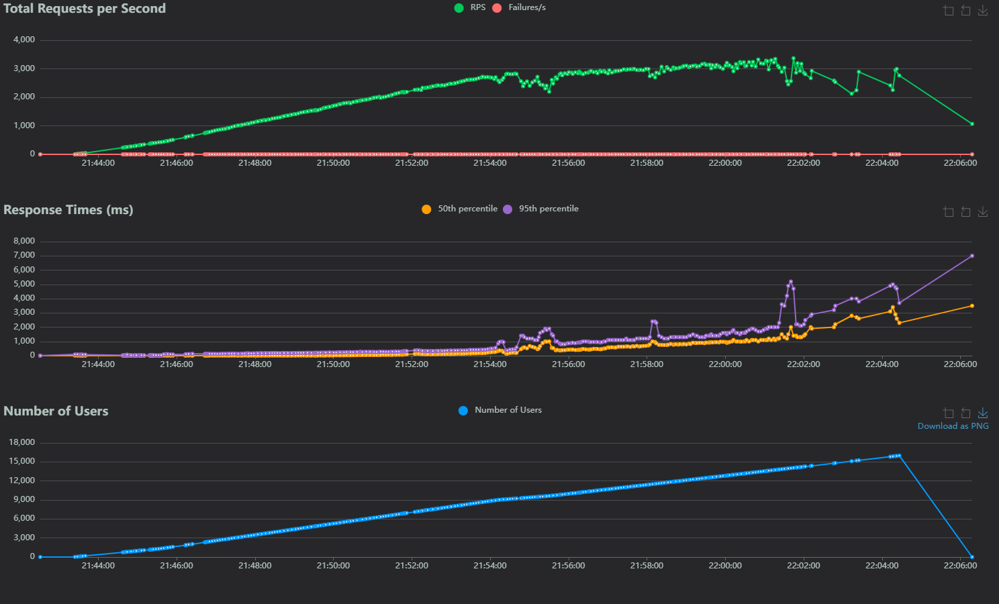

# **Тестовое задание для стажёра Backend-направления (зимняя волна 2025)**

## Магазин мерча

В Авито существует внутренний магазин мерча, где сотрудники могут приобретать товары за монеты (coin). Каждому новому сотруднику выделяется 1000 монет, которые можно использовать для покупки товаров. Кроме того, монеты можно передавать другим сотрудникам в знак благодарности или как подарок.

## Описание задачи

Необходимо реализовать сервис, который позволит сотрудникам обмениваться монетками и приобретать на них мерч. Каждый сотрудник должен иметь возможность видеть:

- Список купленных им мерчовых товаров  
- Сгруппированную информацию о перемещении монеток в его кошельке, включая:  
  - Кто ему передавал монетки и в каком количестве  
  - Кому сотрудник передавал монетки и в каком количестве

Количество монеток не может быть отрицательным, запрещено уходить в минус при операциях с монетками.

## **Общие вводные**

**Мерч** — это продукт, который можно купить за монетки. Всего в магазине доступно 10 видов мерча. Каждый товар имеет уникальное название и цену. Ниже приведён список наименований и их цены.

| Название     | Цена |
|--------------|------|
| t-shirt      | 80   |
| cup          | 20   |
| book         | 50   |
| pen          | 10   |
| powerbank    | 200  |
| hoody        | 300  |
| umbrella     | 200  |
| socks        | 10   |
| wallet       | 50   |
| pink-hoody   | 500  |

Предполагается, что в магазине бесконечный запас каждого вида мерча.

## **Стек сервиса**

**Язык сервиса:** Go.
 
**База данных:** PostgreSQL.
 
Для **деплоя зависимостей и самого сервиса** используется Docker Compose. Порт доступа к сервису 8080 и доступен снаружи как `localhost:8080`.

## **Инструкция по запуску**

1. Склонировать проект к себе на компьютер:

```sh
git clone https://github.com/B0TMirage/avito-assignment-winter-2025.git
```

2. Создать в директории проекта .env файл и внести следующие данные:
```
secret_token = your_token
POSTGRES_DB = data_base
POSTGRES_CONTAINER_NAME = avito_db_container
POSTGRES_USER = avito_user
POSTGRES_PASSWORD = avito_password
POSTGRES_URL= postgres://${POSTGRES_USER}:${POSTGRES_PASSWORD}@${POSTGRES_CONTAINER_NAME}:5432/${POSTGRES_DB}?sslmode=disable
```

3. Запустить докер композе:

```sh
docker compose up -d --build
```

## **Результаты нагрузочного тестирования**

Более подробные результаты находятся в папке [forReadme.](/forReadme/load_testing.html)

